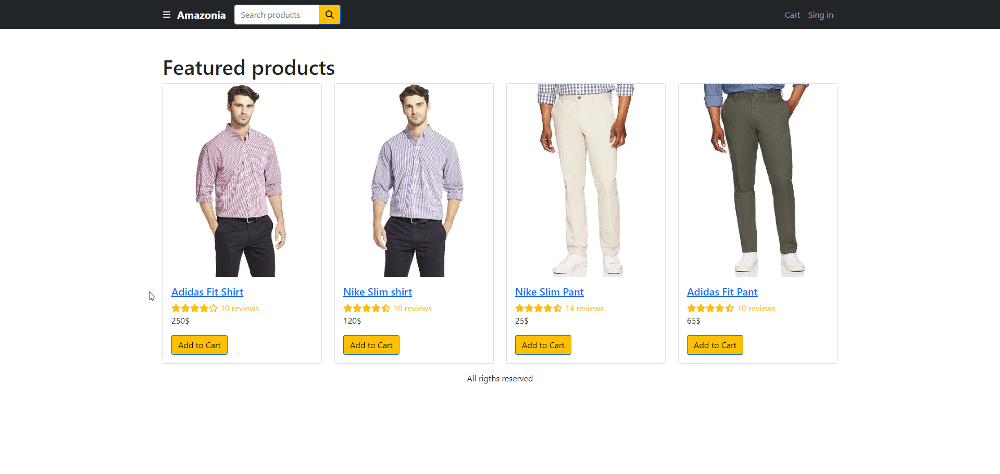
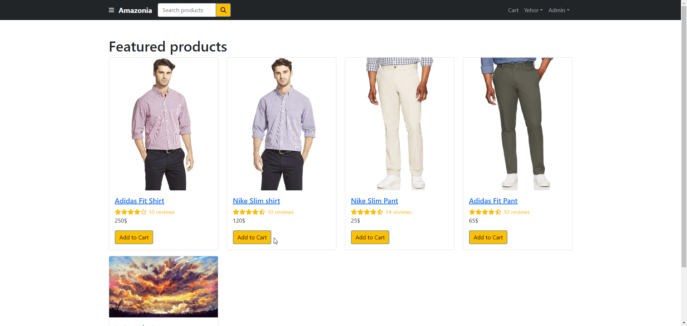

<div id="top"></div>

<div align="center">

<h3 align="center">MERN-Amazonia</h3>

  <p align="center">
    <a href="https://github.com/Freekson/MERN-Amazonia/issues">Report Bug</a>

  </p>
</div>

<!-- TABLE OF CONTENTS -->
<details>
  <summary>Table of Contents</summary>
  <ol>
   <li>
      <a href="#about-the-project">About The Project</a>
    </li>
    <li><a href="#stack">Stack</a></li>  
    <li><a href="#preview">Preview</a></li> 
    <li><a href="#instalation">Installation</a></li>
    <li><a href="#contact">Contact</a></li>
  </ol>
</details>

<!-- ABOUT THE PROJECT -->

# About The Project

### Welcome to the MERN Amazonia!

An E-commerce website built using the MERN (MongoDB, Express, React, Node.js) stack. The website is designed to provide a platform for selling and purchasing various products, similar to Amazon. It offers a comprehensive set of features for both users and administrators.

### Key Features

**User Authentication**

- Users can register and log in securely using JWT (JSON Web Tokens) for authentication.
- Passwords are securely hashed and stored in the database.

**Product Search**

- Users can search for products using filters such as category, price range, and keywords.
- Search results are displayed in a user-friendly manner.

**Shopping Cart**

- Users can add products to their shopping cart, which is stored in their account.
- The cart retains products even after the user logs out and logs back in.

**Order Placement**

- Users can place orders, providing shipping information and payment details.
- PayPal is integrated for secure and convenient payment processing.

**Admin Panel**

- Admins have access to a dashboard with order statistics and charts.
- Admins can manage products by adding, editing, or deleting items.
- Product images can be uploaded and stored on Cloudinary for efficient image management.
- User management allows admins to edit, delete, or suspend user accounts.
- Admins can confirm the delivery of orders, updating the order status accordingly.

<div id="stack"></div>

# Tech Stack Used

- ReactJS
- Redux Toolkit
- TypeScript
- Express
- MongoDB
- React-paypal
- Cloudinary-API
- React-google-charts
- SCSS-Modules
<!-- GETTING STARTED -->

# Preview

_Some gifs may take a long time to load, if you want to see them wait a bit._

**Login and Register Preview**



**Admin Panel Preview**


**Ordering Preview**



**Filter Preview**


<div id="instalation"></div>

# Installation

1. Clone the repo
   ```sh
   git clone https://github.com/Freekson/MERN-Amazonia.git
   ```
2. Go to MERN-Amazonia folder
   ```
   cd MERN-Amazonia
   ```
3. Go to backend folder
   ```
   cd MERN-Amazonia
   ```
4. Install NPM packages for backend
   ```sh
   npm install
   ```
5. Go to frontend folder
   ```
   cd ../client
   ```
6. Install NPM packages for frontend
   ```sh
   npm install
   ```
7. Run backend & frontend command
   ```sh
   npm run dev
   ```

See the [open issues](https://github.com/Freekson/MERN-Amazonia/issues) for a full list of proposed features (and known issues).  
Check the [releases](https://github.com/Freekson/MERN-Amazonia/releases) to see completed items

<!-- CONTACT -->

# Contact

Yehor Dreval

- [Instagram](https://www.instagram.com/freeksons)
- [Telegram](https://t.me/freekson)
- [Linkedin](https://www.linkedin.com/in/yehor-dreval-1634b4207/)

Project Link: [MERN-Amazonia](https://github.com/Freekson/MERN-Amazonia)

<p align="right">(<a href="#top">Back to top</a>)</p>
